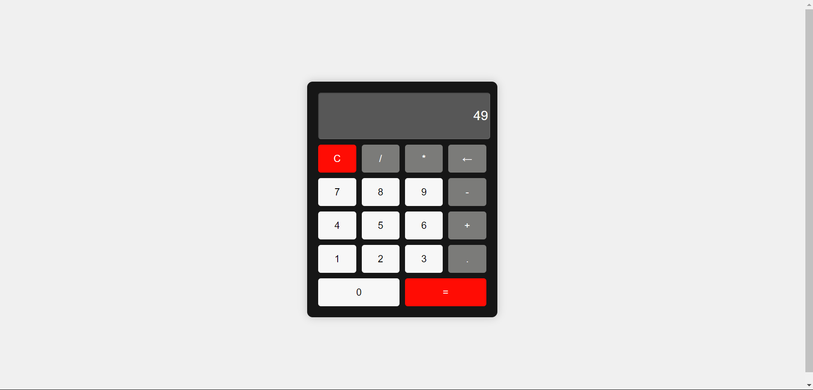

Berikut adalah teks yang telah diformat menggunakan Markdown, termasuk semua poin yang diminta:

```markdown
# Kalkulator Sederhana

Proyek ini adalah kalkulator sederhana yang dibangun menggunakan HTML, CSS, dan JavaScript. Kalkulator ini menyediakan operasi aritmetika dasar seperti penjumlahan, pengurangan, perkalian, dan pembagian. Proyek ini dirancang untuk responsif dan mudah digunakan, menjadikannya tambahan yang baik untuk portofolio Anda.

## Fitur

- **Operasi Aritmetika Dasar**: Melakukan penjumlahan, pengurangan, perkalian, dan pembagian.
- **Desain Responsif**: Kalkulator menyesuaikan tata letaknya untuk berbagai ukuran layar.
- **Penanganan Kesalahan**: Menampilkan pesan kesalahan untuk perhitungan yang tidak valid.
- **Fungsi Hapus dan Backspace**: Mudah menghapus tampilan atau menghapus karakter terakhir.

## Teknologi yang Digunakan

- **HTML**: Struktur antarmuka kalkulator.
- **CSS**: Gaya untuk tata letak dan desain, termasuk tata letak grid responsif.
- **JavaScript**: Logika untuk operasi kalkulator dan interaksi pengguna.

## Memulai

Untuk memulai proyek ini, ikuti langkah-langkah berikut:

### 1. Clone Repositori

```bash
git clone https://github.com/username-anda/kalkulator-sederhana.git
```

### 2. Masuk ke Direktori Proyek

```bash
cd kalkulator-sederhana
```

### 3. Buka Proyek di Browser

Cukup buka file `index.html` di browser pilihan Anda untuk melihat dan berinteraksi dengan kalkulator.

## Struktur File

- `index.html`: Berisi struktur kalkulator.
- `styles.css`: Berisi gaya dan tata letak kalkulator.
- `script.js`: Berisi logika JavaScript untuk menangani perhitungan dan input pengguna.

## Tangkapan Layar



## Cara Menggunakan

1. **Input Angka**: Klik tombol angka untuk memasukkan angka.
2. **Pilih Operasi**: Klik tombol operasi (+, -, *, /) untuk melakukan operasi aritmetika yang diinginkan.
3. **Hitung Hasil**: Tekan tombol = untuk menampilkan hasil perhitungan.
4. **Hapus Tampilan**: Gunakan tombol C untuk menghapus seluruh tampilan.
5. **Backspace**: Gunakan tombol ← untuk menghapus karakter terakhir yang dimasukkan.

## Lisensi

Proyek ini bersifat open-source dan tersedia di bawah Lisensi MIT.
```

Anda dapat mengganti `link-ke-gambar-tangkapan-layar` dan `link-ke-demo` dengan URL yang sesuai. Silakan salin dan gunakan format ini sesuai kebutuhan.Berikut adalah teks yang telah diformat menggunakan Markdown, termasuk semua poin yang diminta:

```markdown
# Kalkulator Sederhana

Proyek ini adalah kalkulator sederhana yang dibangun menggunakan HTML, CSS, dan JavaScript. Kalkulator ini menyediakan operasi aritmetika dasar seperti penjumlahan, pengurangan, perkalian, dan pembagian. Proyek ini dirancang untuk responsif dan mudah digunakan, menjadikannya tambahan yang baik untuk portofolio Anda.

## Fitur

- **Operasi Aritmetika Dasar**: Melakukan penjumlahan, pengurangan, perkalian, dan pembagian.
- **Desain Responsif**: Kalkulator menyesuaikan tata letaknya untuk berbagai ukuran layar.
- **Penanganan Kesalahan**: Menampilkan pesan kesalahan untuk perhitungan yang tidak valid.
- **Fungsi Hapus dan Backspace**: Mudah menghapus tampilan atau menghapus karakter terakhir.

## Teknologi yang Digunakan

- **HTML**: Struktur antarmuka kalkulator.
- **CSS**: Gaya untuk tata letak dan desain, termasuk tata letak grid responsif.
- **JavaScript**: Logika untuk operasi kalkulator dan interaksi pengguna.

## Memulai

Untuk memulai proyek ini, ikuti langkah-langkah berikut:

### 1. Clone Repositori

```bash
git clone https://github.com/username-anda/kalkulator-sederhana.git
```

### 2. Masuk ke Direktori Proyek

```bash
cd kalkulator-sederhana
```

### 3. Buka Proyek di Browser

Cukup buka file `index.html` di browser pilihan Anda untuk melihat dan berinteraksi dengan kalkulator.

## Struktur File

- `index.html`: Berisi struktur kalkulator.
- `styles.css`: Berisi gaya dan tata letak kalkulator.
- `script.js`: Berisi logika JavaScript untuk menangani perhitungan dan input pengguna.

## Tangkapan Layar


## Cara Menggunakan

1. **Input Angka**: Klik tombol angka untuk memasukkan angka.
2. **Pilih Operasi**: Klik tombol operasi (+, -, *, /) untuk melakukan operasi aritmetika yang diinginkan.
3. **Hitung Hasil**: Tekan tombol = untuk menampilkan hasil perhitungan.
4. **Hapus Tampilan**: Gunakan tombol C untuk menghapus seluruh tampilan.
5. **Backspace**: Gunakan tombol ← untuk menghapus karakter terakhir yang dimasukkan.

## Demo Proyek

- **Demo Langsung**: [Link Demo](link-ke-demo)

## Lisensi

Proyek ini bersifat open-source dan tersedia di bawah Lisensi MIT.
```

Anda dapat mengganti `link-ke-gambar-tangkapan-layar` dan `link-ke-demo` dengan URL yang sesuai. Silakan salin dan gunakan format ini sesuai kebutuhan.